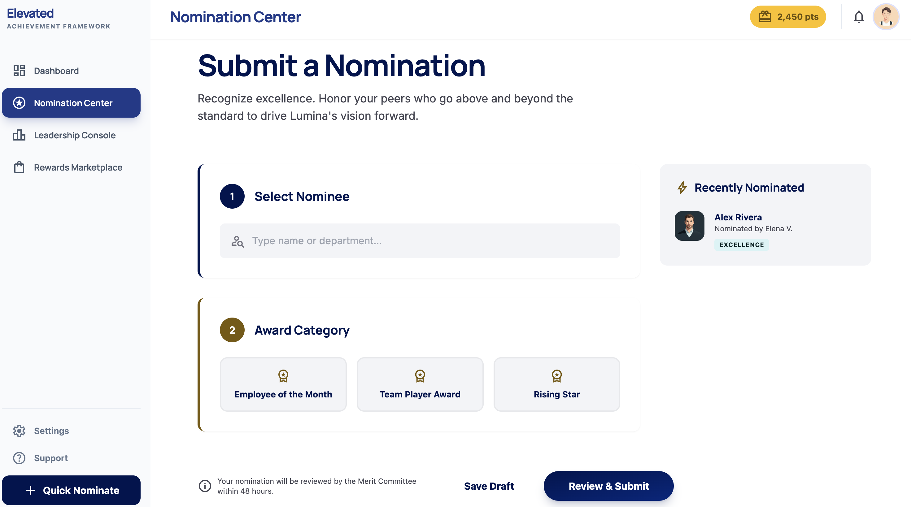
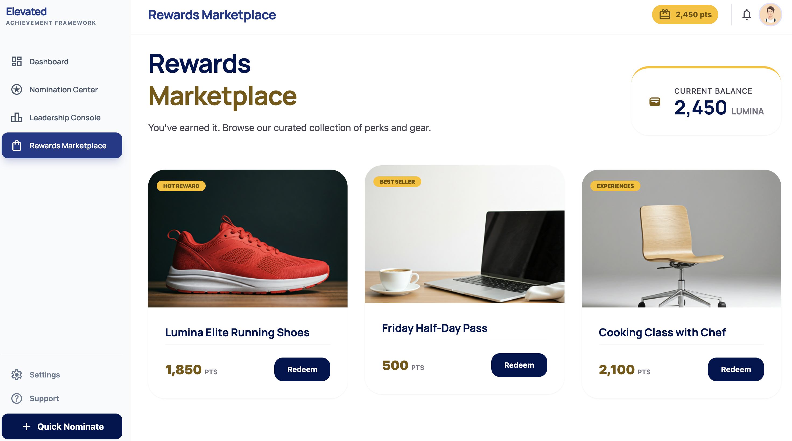
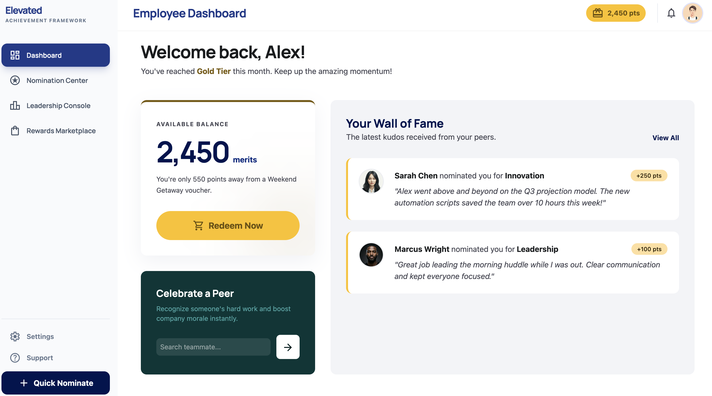
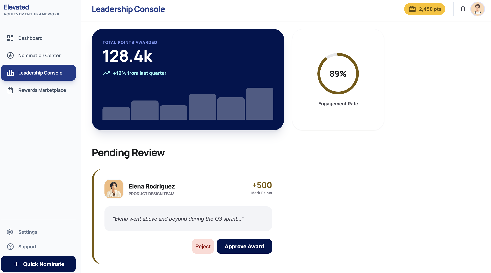

# 0Proposal: Employee Engagement & Recognition Platform

**Prepared for:** The Arc Mercer
**Prepared by:** IoTeye Inc.
**Date:** April 8, 2026
**In Response To:** Request for Proposal — Employee Engagement & Recognition Platform (February 2026)

---

## Table of Contents

1. [Executive Summary](#1-executive-summary)
2. [Company Profile](#2-company-profile)
3. [Technical Approach](#3-technical-approach)
4. [Scope of Work &amp; Solution Design](#4-scope-of-work--solution-design)
5. [Integration Strategy](#5-integration-strategy)
6. [Accessibility Statement](#6-accessibility-statement)
7. [Phased Implementation Plan &amp; Timeline](#7-phased-implementation-plan--timeline)
8. [Cost Proposal](#8-cost-proposal)
9. [Evaluation Criteria Alignment](#9-evaluation-criteria-alignment)
10. [Appendices](#10-appendices)

---

## 1. Executive Summary

We are pleased to submit this proposal in response to The Arc Mercer's Request for Proposal for an Employee Engagement & Recognition Platform. We understand the critical importance of transitioning from manual recognition processes to a structured, scalable system that fosters a culture of appreciation across your residential and day programs.

Our proposed solution is a custom-built, cloud-hosted SaaS platform leveraging modern, battle-tested technologies — **React** and **TypeScript** for the front end, **Supabase** (PostgreSQL) for the backend and real-time data layer, **Python** for integrations and business logic services, and **AWS** for secure, scalable cloud deployment. This technology stack delivers a high-quality, maintainable, and cost-effective platform tailored precisely to The Arc Mercer's unique requirements.

**Key Differentiators:**

- **Custom-Built for Your Workforce:** Unlike off-the-shelf platforms, our solution is designed from the ground up for non-technical, frontline staff — large buttons, intuitive icons, minimal text, and mobile-first design.
- **Seamless Paycom Integration:** A dedicated Python integration service ensures reliable, automated user provisioning and program assignment syncing with your HRIS.
- **Phased Delivery with Early Value:** Phase One goes live within 12 weeks of kickoff, delivering nominations, Paycom sync, and manual point support immediately.
- **Transparent & Auditable:** Every point adjustment is logged with full audit trails, giving leadership complete visibility and control.
- **Scalable SaaS Architecture:** AWS-hosted infrastructure scales with your organization and ensures 99.9% uptime.

---

## 2. Company Profile

### About IoTeye Inc.

**IoTeye Inc.** is a remote software products company headquartered in **Basking Ridge, New Jersey**. For over **5 years**, IoTeye has been building and delivering high-quality software products and tools — with a particular focus on the **special care** sector. Over **1,000 consumers** trust IoTeye's platforms today.

**Website:** [www.ioteyeinc.com](https://www.ioteyeinc.com)
**Contact:** mingjye.sheng@ioteyeinc.com

### Solutions & Services

IoTeye's portfolio spans multiple domains directly relevant to The Arc Mercer's mission:

| Area                                              | Description                                                                                                                                                                                       |
| ------------------------------------------------- | ------------------------------------------------------------------------------------------------------------------------------------------------------------------------------------------------- |
| **Special Care**                            | Purpose-built tools for organizations serving individuals with specialized care needs — IoTeye's core domain and the foundation of our understanding of your workforce.                          |
| **BrainBook (AI Agents for Special Care)** | AI-powered agent platform tailored for special care organizations, demonstrating our capacity to build intelligent, data-driven business systems.                                                 |
| **Route Optimization**                      | Intelligent routing solutions — our flagship product — showcasing expertise in real-time data processing and optimization algorithms.                                                           |
| **Communication Studio**                    | Communication and engagement tools, directly transferable to employee recognition and notification systems.                                                                                       |
| **Class Attendance & Contact Tracing**      | Attendance tracking and people-management systems, demonstrating experience with check-in workflows and activity logging similar to the TAC meeting and engagement tracking required in this RFP. |

### Products

- **SpringBoard** — IoTeye's flagship multi-agency route management and operations platform. SpringBoard provides a comprehensive admin portal for special care transportation organizations, including route optimization, fleet management (OBD and camera integration), vehicle maintenance tracking, scheduling (cron-based automation), and Twilio-powered SMS/conversational communication. The platform features a multi-tenant architecture supporting multiple agencies (e.g., Arc Mercer, Easter Seals), a React-based admin dashboard, REST APIs for mobile and web clients, and a robust security framework with role-based access control. SpringBoard demonstrates IoTeye's proven ability to build and operate complex, data-driven SaaS platforms for the special care sector.
- **BrainBook** — An AI-powered platform built with Next.js 14 (React/TypeScript), Supabase authentication, and Tauri for cross-platform desktop deployment. BrainBook features local AI model management and inference, an interactive chat interface with streaming responses, AI-driven note generation, voice I/O (text-to-speech and speech-to-text), an agent system with a standalone Node.js agent server, Node-RED workflow automation integration, and OAuth/SSO authentication. The platform runs as both a web application and a native desktop app, demonstrating IoTeye's expertise in React, TypeScript, Supabase, and modern full-stack architecture — the same technology stack proposed for this project.
- **Guardian** — A multi-agency, multi-department notification and communication system. Guardian provides SMS messaging (via Twilio), mobile push notifications (via Expo), reply tracking, confirmation workflows, and location-aware alerts — all organized by agency and department. The system includes a server backend (Node.js/Docker/Supabase) and a cross-platform mobile app (React Native/Expo) published to both iOS and Android app stores. Guardian's multi-tenant architecture and real-time notification capabilities directly parallel the engagement and notification features required for this project.
- **BrainClaw (AI Agent Gateway)** — IoTeye's production AI agent runtime, built on BrainBook's infrastructure and powered by GPT-4.1 via GitHub Copilot. BrainClaw hosts domain-specific Python skill agents accessed through a structured JSON protocol. Currently running two agents in production for **The Arc Mercer**:

  - **SpringBoard Agent (37 tools):** fleet management, route optimization, consumer management, scheduling, SMS/push notifications, real-time GPS telemetry, emergency SOS, and daily manifest/invoice generation. Arc Mercer staff (`arcmercer.ioteyeinc.com`) manage paratransit operations through natural language today.
  - **Samsara Agent (57 tools):** vehicle telematics, driver management, Hours of Service (HOS) compliance, safety events, Driver Vehicle Inspection Reports (DVIRs), equipment/trailer tracking, geofencing, fuel/energy reporting, and fleet-wide GPS.

  The same BrainClaw framework will be extended to the recognition platform, giving Arc Mercer a unified AI workspace spanning operations and employee engagement.

### Why IoTeye for This Project

IoTeye's **special care industry expertise** is a direct match for The Arc Mercer's needs. Unlike general-purpose software vendors, IoTeye understands:

- **The frontline workforce** — direct-support professionals who primarily use smartphones and need simple, intuitive interfaces.
- **Compliance and auditability** — regulated care environments require transparent, traceable systems with full audit trails.
- **Budget-conscious operations** — non-profit organizations need maximum ROI with sustainable long-term costs.
- **User diversity** — designing for staff with varying levels of technical literacy is a core competency, not an afterthought.

Having built and operated SaaS products like SpringBoard, Guardian, and BrainBook, IoTeye brings proven experience in the full lifecycle: design, development, cloud deployment, and ongoing support. **The Arc Mercer is already a SpringBoard and Guardian customer**, giving IoTeye direct familiarity with your organization's operational environment and needs.

> **BrainClaw AI agents are already in production at Arc Mercer today.** IoTeye's SpringBoard Agent (37 tools) and Samsara Agent (57 tools) power Arc Mercer's transportation operations — staff manage routes, fleet, and driver compliance through natural language conversation. The same BrainClaw AI agent framework extends into the recognition platform, giving Arc Mercer a unified AI workspace for operations and employee engagement — a capability no general-purpose recognition vendor can offer.

### IoTeye Platform Ecosystem — Total Agency Services for Special Care

IoTeye's platform is purpose-built for the special care industry, serving a U.S. market of over **6,000 special care agencies**.

- **Special Care Cloud (AWS):** All IoTeye services run on HIPAA-compliant AWS infrastructure.
- **Agentic AI Platform:** IoTeye's unique differentiator — an AI-first platform spanning Cloud, Desktop, Mobile, and IoT, delivering personal assistants for agency workflows.
- **Apps for Every Stakeholder:** Dedicated applications for Parent/Guardian, Consumer/Patient, and Staff/Driver roles.
- **IoT & Sensor Integration:** OBD devices, DashCams, Minew proximity detection systems, Home Assistant Green, and Samsara App Partner integration for fleet and facility monitoring.
- **Multi-Form-Factor Delivery:** Desktop, Web, Tablet, Mobile, and ESP Box (Personal Assistants).
- **HIPAA-Compliant AI Servers:** All AI inference and data processing meets healthcare privacy standards.

### Technology Stack Proficiency

| Technology                      | Role in This Project                              | IoTeye Experience                                                                                                            |
| ------------------------------- | ------------------------------------------------- | ---------------------------------------------------------------------------------------------------------------------------- |
| **React + TypeScript**    | Front-end application                             | Production SaaS applications (SpringBoard, BrainBook) serving 1,000+ users; component-based architecture for maintainability |
| **Supabase (PostgreSQL)** | Database, authentication, real-time subscriptions | Production deployments leveraging Row Level Security, real-time listeners, and built-in auth                                 |
| **Python**                | Integration services, business logic, automation  | Extensive experience building API integrations, ETL pipelines, and scheduled jobs across IoTeye's product suite              |
| **AWS**                   | Cloud infrastructure & deployment                 | Production SaaS deployments using ECS/Fargate, RDS, S3, CloudFront, and Lambda — powering IoTeye's live products            |

### Commitment to The Arc Mercer's Mission

As a company whose core business is **special care software**, IoTeye deeply understands The Arc Mercer's mission of supporting individuals with intellectual and developmental disabilities. An employee recognition platform directly supports staff retention and morale — critical factors in maintaining quality of care. IoTeye's approach prioritizes simplicity, accessibility, and sustainability to ensure this platform delivers lasting value for your organization and the people it serves.

---

## 3. Technical Approach

### 3.1 Architecture Overview: Custom SaaS Build

We recommend a **custom-built SaaS solution** rather than an off-the-shelf product. This approach ensures The Arc Mercer receives a platform precisely tailored to its workflows, terminology, and organizational structure — without paying for features you don't need or compromising on ones you do.

```
┌─────────────────────────────────────────────────────────┐
│                    Client Layer                         │
│   React + TypeScript Progressive Web App (PWA)          │
│   Mobile-First Responsive Design                        │
│   Offline Capability for Low-Connectivity Environments  │
└──────────────────────┬──────────────────────────────────┘
                       │ HTTPS
┌──────────────────────▼──────────────────────────────────┐
│                  API / Backend Layer                     │
│   Supabase (PostgreSQL + PostgREST + Auth + Realtime)   │
│   Row Level Security (RLS) for Data Access Control      │
│   Edge Functions for Business Logic                     │
└──────────────────────┬──────────────────────────────────┘
                       │
┌──────────────────────▼──────────────────────────────────┐
│              Integration Services Layer                  │
│   Python Microservice (FastAPI)                          │
│   • Paycom HRIS Sync (API / SFTP)                       │
│   • Gift Card Vendor API Integration                    │
│   • Scheduled Jobs (Birthdays, Anniversaries)           │
│   • Notification Service (Email / Push)                 │
└──────────────────────┬──────────────────────────────────┘
                       │
┌──────────────────────▼──────────────────────────────────┐
│                 AWS Infrastructure                       │
│   ECS Fargate (Containers) │ CloudFront (CDN)           │
│   S3 (Static Assets)       │ RDS (if needed)            │
│   Secrets Manager          │ CloudWatch (Monitoring)    │
│   WAF (Security)           │ Route 53 (DNS)             │
└─────────────────────────────────────────────────────────┘
                       │
┌──────────────────────▼──────────────────────────────────┐
│     BrainClaw AI Agent Layer (Optional Add-On)          │
│   GPT-4.1 Powered  │  Python Skill Protocol             │
│   • Natural Language Analytics  • Smart Anomaly Alerts  │
│   • Nomination Coaching         • Ad-hoc HR Reports     │
│   Already running at Arc Mercer: SpringBoard + Samsara  │
└─────────────────────────────────────────────────────────┘
```

### 3.2 Technology Selection Rationale

| Component                    | Technology            | Why                                                                                                                                                                                                         |
| ---------------------------- | --------------------- | ----------------------------------------------------------------------------------------------------------------------------------------------------------------------------------------------------------- |
| **Front End**          | React + TypeScript    | Type-safe, component-based UI. Massive ecosystem for accessibility components. Progressive Web App (PWA) support for native-like mobile experience without app store distribution.                          |
| **Backend & Database** | Supabase (PostgreSQL) | Instant API generation, built-in authentication (supports SSO), Row Level Security for data isolation, real-time subscriptions for live dashboards, and managed infrastructure reducing operational burden. |
| **Integration Layer**  | Python (FastAPI)      | Best-in-class library ecosystem for HRIS integrations (SFTP, REST APIs, CSV parsing). Easy to maintain and extend for future integrations.                                                                  |
| **Cloud Platform**     | AWS                   | HIPAA-eligible infrastructure, SOC 2 compliance, auto-scaling, and 99.99% availability SLA.                                                                                                                 |

### 3.3 Security & Compliance

- **Data Encryption:** AES-256 encryption at rest; TLS 1.3 in transit.
- **Authentication:** Supabase Auth with support for SSO (SAML 2.0 / OAuth 2.0) — enabling employees to log in with existing organizational credentials.
- **Authorization:** Row Level Security (RLS) policies ensure employees only access their own data; admins and leadership access scoped to their programs.
- **Audit Logging:** Every point transaction, nomination action, and admin operation is logged with timestamp, actor, and action detail — immutable and queryable.
- **Infrastructure Security:** AWS WAF for web application firewall protection, VPC isolation, and secrets management via AWS Secrets Manager.

---

## 4. Scope of Work & Solution Design

### A. Program-Based Competition Engine

**Hierarchical Grouping:**

- Flexible program hierarchy supporting multi-level groupings (e.g., Residential → Group Homes; Day Programs → Campus, Senior, OTC, Janitorial).
- Programs are synced from Paycom to ensure employee-program assignments are always current.
- Admin UI to create, edit, and archive programs as organizational structure evolves.

**Nomination Workflow:**

- Intuitive submission portal with large, clearly labeled buttons for each award type:
  - 🏆 **Employee of the Month**
  - ⭐ **Rising Star**
  - 👥 **Team Impact Award**
- Step-by-step guided form: select nominee → select award type → write nomination statement → submit.
- Auto-populated nominee list filtered by program, with search functionality.

**Submission Logic:**

- Enforced business rules at the database level:
  - Maximum **1 nomination per candidate per month** per user.
  - Maximum **5 total nominations per month** per user.
- Clear, friendly UI feedback when limits are reached (e.g., "You've already nominated this person this month — thank you for your enthusiasm!").
- Monthly counters reset automatically on the 1st of each month.

**QA Queue (Administrative Dashboard):**

- Dedicated admin view showing all pending nominations with:
  - Nominee name, nominator, award type, program, and nomination text.
  - One-click actions: **Approve**, **Return for Edits** (with comment field), or **Decline** (with reason).
- Batch operations for high-volume periods.
- Filter and sort by program, award type, date, and status.
- Points are only awarded upon admin approval — never automatically on submission.


*Nomination Center: Guided step-by-step form with award category selection (Employee of the Month, Team Player Award, Rising Star) and real-time nomination feedback.*

### B. Point Allocation & Engagement Tracking

**Top-Down Bestowal:**

- Leadership and authorized managers can instantly award ad-hoc points from a dedicated "Bestow Points" interface.
- Requires selection of recipient, point amount, and reason/category.
- Bestowed points appear immediately on the employee's dashboard with a recognition notification.

**Multi-Stream Accrual:**
Points are earned through multiple configurable streams:

| Stream                              | Point Value           | Trigger                             |
| ----------------------------------- | --------------------- | ----------------------------------- |
| Employee of the Month (Approved)    | Configurable by admin | QA queue approval                   |
| Rising Star of the Month (Approved) | Configurable by admin | QA queue approval                   |
| Team Impact Award (Approved)        | Configurable by admin | QA queue approval                   |
| TAC Meeting Attendance              | Configurable by admin | Admin check-in or attendance import |
| Newsletter Trivia                   | Configurable by admin | Correct answer submission           |
| Birthday Milestone                  | Configurable by admin | Automated (Paycom DOB sync)         |
| Work Anniversary Milestone          | Configurable by admin | Automated (Paycom hire date sync)   |
| Leadership Bestowal                 | Variable              | Manual award by leadership          |

- All point values are administrator-configurable — no code changes needed to adjust values.
- Milestone points (birthdays, anniversaries) are triggered automatically via scheduled jobs synced with Paycom data.

**Audit Trails:**

- Complete, immutable transaction log for every point adjustment:
  - **Fields:** Timestamp, employee, action type (earned/redeemed/adjusted/voided), point amount, source/reason, performed by.
- Admin reporting dashboard with:
  - Filterable transaction history by employee, program, date range, and type.
  - Export to CSV for external review.
  - Anomaly highlighting (e.g., unusually large bestowals).

### C. The Rewards Marketplace

**Digital Storefront:**

- Clean, visual catalog displaying available rewards with images, point costs, and descriptions.
- Categories: **Branded Merchandise**, **Cafeteria Meals**, **Digital Gift Cards**.
- Real-time point balance displayed prominently during browsing.
- One-tap redemption with confirmation dialog to prevent accidental spending.
- Order history view for employees.


*Rewards Marketplace: Point balance displayed at a glance, curated product catalog with category badges (Hot Reward, Best Seller, Experiences), and one-tap Redeem buttons.*

**Fulfillment Tools:**

- Admin inventory management dashboard:
  - Add/edit/remove items with images, descriptions, point costs, and stock quantities.
  - Low-stock alerts and out-of-stock auto-hiding.
- Order fulfillment queue:
  - New orders appear in real-time.
  - Status tracking: **Pending → Processing → Fulfilled / Shipped**.
  - Employee notification on status changes.
- Digital gift card integration:
  - API-based delivery for instant digital gift card fulfillment (e.g., via a vendor such as Tango Card or similar).
  - Automated delivery via email with tracking.

### D. User Experience (UX) & Accessibility

**Universal Design Principles:**

- **Large touch targets:** Minimum 48x48px tap areas (exceeding WCAG 2.1 AA requirements).
- **High-contrast interface:** WCAG AAA contrast ratios (7:1) for all text and interactive elements.
- **Icon-driven navigation:** Every action has an accompanying icon — users never rely solely on text labels.
- **Minimal text-heavy menus:** Bottom navigation bar with 4-5 core actions (Home, Nominate, Store, My Points, Profile).
- **Progressive disclosure:** Complex features are behind simple entry points, avoiding information overload.
- **Reading level:** All interface text written at a 6th-grade reading level or below.

**Mobile-First Design:**

- **Progressive Web App (PWA):** Installable on any smartphone home screen without app store download — no high-end hardware required.
- **Responsive layout:** Designed for 320px+ screens, scaling gracefully to tablets and desktops.
- **Touch-optimized:** Swipe gestures, pull-to-refresh, and haptic-style feedback.
- **Low-bandwidth friendly:** Lazy-loaded images, compressed assets, and optional offline mode for unreliable connectivity.

**Dashboards:**

*Employee Dashboard:*

- Points balance (large, centered display).
- Recent point activity feed.
- Nomination status tracker.
- "Quick Nominate" action button.
- Birthday/Anniversary recognition feed.


*Employee Dashboard: Points balance prominently displayed, Wall of Fame showing peer nominations with point awards, and a "Celebrate a Peer" quick-nominate shortcut.*

*Leadership Dashboard:*

- Participation metrics by program (nomination counts, engagement rates).
- Trend charts (weekly/monthly activity).
- QA queue status (pending nominations count).
- Top nominators and nominees leaderboard.
- Point economy overview (points issued vs. redeemed).


*Leadership Console: Total points awarded (128.4k, +12% quarter-over-quarter), 89% engagement rate gauge, and Pending Review QA queue with approve/reject actions for nominations.*

### E. AI Agent Assistant (Optional Add-On)

IoTeye's **BrainClaw** AI agent framework — already in production for The Arc Mercer's SpringBoard and Samsara integrations — can be extended to provide a conversational AI assistant directly within the recognition platform.

**Natural language capabilities for HR and leadership:**

| Query                                                  | What the Agent Does                                                |
| ------------------------------------------------------ | ------------------------------------------------------------------ |
| "Which program had the most nominations last month?"   | Queries the engagement database, returns ranked results by program |
| "Which employees haven't been recognized in 60+ days?" | Scans all records, flags at-risk staff by department               |
| "Flag any unusual point bestowals this week"           | Runs anomaly detection across the full point ledger                |
| "Generate a nominator activity report for Q1"          | Assembles and exports a formatted CSV/summary                      |
| "What's our overall engagement score this month?"      | Calculates real-time KPIs and highlights trends                    |

**Technical Implementation:**

- A new BrainClaw skill (`recognition_agent`) with tools bound to the recognition platform's Supabase database via role-scoped queries.
- Accessible from the same **BrainBook** interface Arc Mercer already uses for SpringBoard and Samsara — one unified AI workspace.
- No new infrastructure required — deployed on the existing BrainClaw gateway.
- Role-aware: HR directors see org-wide data; program managers see their programs only.

**Arc Mercer Advantage:** Arc Mercer staff already use BrainClaw AI agents to manage transportation operations today. Adding a recognition agent gives leadership a single conversational AI interface for fleet operations, driver compliance, and employee engagement — a capability unique to IoTeye.

---

## 5. Integration Strategy

### 5.1 Paycom Integration (Critical)

We propose a **dual-channel integration approach**, with SFTP as the primary method and REST API as an optional enhancement:

**Primary: SFTP File Transfer**

Paycom's standard SFTP export is the most broadly supported integration method and does not require additional API subscription tiers. This is expected to be the primary approach for The Arc Mercer.

- **Automated Nightly Sync:** Paycom generates a scheduled CSV/XML employee data export, delivered to a secure SFTP endpoint hosted on AWS.
- **Python ETL Service:** A dedicated Python (FastAPI) service picks up the file, parses, validates, and upserts employee records into Supabase (PostgreSQL).
- **Automated User Provisioning:**
  - New hires added to the platform automatically after the next sync cycle.
  - Terminated employees automatically deactivated (soft delete — data retained for audit).
  - Program/department assignment changes reflected automatically.
- **Data Fields Synced:** Employee ID, name, email, program/department assignment, hire date, date of birth, employment status.
- **Discrepancy Reports:** Any data anomalies (e.g., missing fields, duplicate records) are flagged and sent to HR for review.
- **Sync Schedule:** Nightly full sync, with the ability to trigger on-demand syncs as needed.

**Optional Enhancement: Paycom REST API**

If The Arc Mercer's Paycom subscription supports REST API access, we can add near-real-time syncing as an enhancement:

- Event-driven incremental sync (if Paycom webhooks are available).
- Real-time employee lookups for faster onboarding.
- This can be added at any time without disrupting the SFTP-based sync.

**Integration Architecture:**

```
Paycom HRIS
    │
    ├── SFTP Export (Primary) ──► AWS S3 ──► Python ETL Service (FastAPI)
    │                                              │
    └── REST API (Optional) ───────────────────────┤
                                                   │
                                                   ▼
                                         Supabase (PostgreSQL)
                                          Employee Records Table
                                                   │
                                                   ▼
                                         React Front End (Live Data)
```

**Error Handling & Monitoring:**

- Retry logic with exponential backoff for API failures.
- Admin notifications for sync errors or data discrepancies.
- Monthly sync health reports.

### 5.2 Single Sign-On (SSO)

- **Supabase Auth** natively supports SAML 2.0, OAuth 2.0, and OIDC — enabling flexible identity provider configuration without code changes.
- **Initial Deployment: Google Workspace SSO** — We will configure SSO with The Arc Mercer's current Google Workspace identity provider. Employees sign in with their existing Google organizational accounts.
- **Future Migration Path: Microsoft Entra ID (Azure AD)** — Supabase Auth supports multiple identity providers simultaneously. When The Arc Mercer migrates to Microsoft, we can add Microsoft Entra ID as an SSO provider with zero downtime — both providers can run in parallel during the transition period.
- **Employee experience:** Click "Sign In" → redirect to familiar Google (or future Microsoft) login → automatically authenticated and returned to the platform.
- **Fallback:** Email/password login for users without SSO credentials (e.g., part-time or seasonal staff), with secure password policies enforced.

---

## 6. Accessibility Statement

Our commitment to accessibility is central to this project, given The Arc Mercer's diverse workforce:

### Design Philosophy

We design for the **least technically experienced user first**. Every interface decision is validated against the question: *"Could a person who only uses their phone for calls and texts successfully complete this action?"*

### Specific Accommodations

| Challenge                   | Our Solution                                                                         |
| --------------------------- | ------------------------------------------------------------------------------------ |
| Low technical literacy      | Icon-based navigation, step-by-step guided flows, no jargon                          |
| Small screen / older phones | Mobile-first PWA, works on any modern browser, no app download required              |
| Low vision / contrast needs | WCAG AAA contrast ratios, large fonts (min 16px body text), resizable text           |
| Motor difficulties          | Large touch targets (48x48px minimum), generous spacing between actions              |
| Cognitive load              | Progressive disclosure, one primary action per screen, clear success/error messaging |
| Language diversity          | Simple language (6th grade level), icon-first design reduces language dependency     |

### Standards Compliance

- **WCAG 2.1 Level AA** compliance — with AAA targets for contrast and text sizing.
- **Keyboard navigable** — full functionality available without a mouse.
- **Screen reader compatible** — semantic HTML, ARIA labels, and tested with NVDA/VoiceOver.

### Ongoing Accessibility

- User testing with frontline staff during each phase.
- Accessibility audit before each phase launch.
- Feedback mechanism built into the app for reporting usability issues.

---

## 7. Phased Implementation Plan & Timeline

### Phase One: Foundation (Weeks 1–12)

> *Centralized nominations, Paycom sync, and manual point support*

| Week  | Milestone                                                                                                                                          |
| ----- | -------------------------------------------------------------------------------------------------------------------------------------------------- |
| 1–2  | **Kickoff & Discovery** — Requirements workshops with stakeholders, Paycom SFTP access setup, environment provisioning                      |
| 3–5  | **Core Infrastructure** — AWS deployment pipeline, Supabase schema design, authentication/SSO configuration, Paycom integration development |
| 6–8  | **Nomination Engine** — Submission portal, QA queue, program hierarchy, nomination business rules                                           |
| 9–10 | **Point System (Manual)** — Admin point bestowal, point balance views, audit trail, leadership dashboard                                    |
| 11    | **User Acceptance Testing (UAT)** — Testing with selected staff across programs, accessibility audit                                        |
| 12    | **Phase One Launch** — Production deployment, staff onboarding, admin training                                                              |

**Phase One Deliverables:**

- Nomination submission portal (Employee of the Month, Rising Star, Team Impact)
- QA queue with approve/return/decline workflow
- Paycom user sync (automated provisioning)
- SSO login
- Manual point bestowal by leadership
- Basic point balance display
- Admin audit trail

### Phase Two: Engagement (Weeks 13–24)

> *Individual dashboards and automated activity tracking*

| Week   | Milestone                                                                                                                 |
| ------ | ------------------------------------------------------------------------------------------------------------------------- |
| 13–15 | **Employee Dashboards** — Personalized point history, nomination tracker, activity feed                            |
| 16–18 | **Leadership Dashboards** — Participation metrics, trend charts, program comparisons                               |
| 19–21 | **Automated Tracking** — TAC meeting attendance logging, newsletter trivia module, birthday/anniversary automation |
| 22–23 | **UAT & Refinement** — User testing, performance optimization                                                      |
| 24     | **Phase Two Launch** — Feature rollout, updated training materials                                                 |

**Phase Two Deliverables:**

- Full employee dashboards with point history and progress
- Leadership analytics dashboards with trends
- Automated birthday and anniversary point awards
- TAC meeting attendance tracking
- Newsletter trivia integration
- Push/email notifications

### Phase Three: Marketplace (Weeks 25–36)

> *Full Store activation and fulfillment workflows*

| Week   | Milestone                                                                                    |
| ------ | -------------------------------------------------------------------------------------------- |
| 25–27 | **Storefront Development** — Product catalog, category browsing, point-based checkout |
| 28–30 | **Fulfillment System** — Order management, status tracking, admin inventory tools     |
| 31–33 | **Gift Card Integration** — Vendor API integration, automated digital delivery        |
| 34–35 | **UAT & Load Testing** — End-to-end testing, security audit                           |
| 36     | **Phase Three Launch & Full Platform Go-Live**                                         |

**Phase Three Deliverables:**

- Digital rewards storefront
- Physical merchandise ordering and fulfillment tracking
- Digital gift card instant delivery
- Inventory management tools
- Complete platform with all features active

### Overall Timeline Summary

```
Month 1–3:  ████████████████ Phase One (Foundation)
Month 4–6:  ░░░░░░░░░░░░████████████████ Phase Two (Engagement)  
Month 7–9:  ░░░░░░░░░░░░░░░░░░░░░░░░████████████████ Phase Three (Marketplace)
```

**Total Duration: ~36 weeks (9 months) from kickoff to full launch.**

---

## 8. Cost Proposal

We offer two pricing options to accommodate different budget and ownership preferences:

---

### Option A: Source-Code Ownership (Custom Build)

Under this option, The Arc Mercer **owns the source code and all intellectual property**. IoTeye delivers the platform, and The Arc Mercer retains full control to modify, extend, or migrate the system independently in the future.

#### 8.1 Implementation Fees (One-Time)

| Phase                          | Description                                                       | Est. Hours           | Cost               |
| ------------------------------ | ----------------------------------------------------------------- | -------------------- | ------------------ |
| Phase One                      | Nominations, Paycom Sync, Manual Points, SSO, Core Infrastructure | ~480 hrs             | $45,000            |
| Phase Two                      | Dashboards, Automated Tracking, Notifications                     | ~310 hrs             | $35,000            |
| Phase Three                    | Rewards Marketplace, Gift Card Integration, Fulfillment           | ~280 hrs             | $30,000            |
| **Total Implementation** |                                                                   | **~1,070 hrs** | **$110,000** |

*Includes: discovery, design, development, testing, deployment, training, and documentation.*

**Detailed Effort Breakdown:**

**Phase One — $45,000 (~480 hours, Weeks 1–12)**

| Task                                                                         | Hours |
| ---------------------------------------------------------------------------- | ----- |
| Discovery & requirements workshops                                           | ~40   |
| AWS infrastructure setup (ECS, CloudFront, CI/CD pipeline)                   | ~40   |
| Supabase schema design, RLS policies, auth/SSO configuration                 | ~40   |
| Paycom integration service (API + SFTP fallback, error handling, monitoring) | ~80   |
| Nomination engine (submission portal, business rules, guided flows)          | ~80   |
| QA queue (admin dashboard, approve/return/decline workflow)                  | ~60   |
| Manual point bestowal + audit trail                                          | ~40   |
| UI/UX design (mobile-first, WCAG AAA, icon-driven, accessibility)            | ~60   |
| UAT, accessibility audit, deployment, staff training                         | ~40   |

**Phase Two — $35,000 (~310 hours, Weeks 13–24)**

| Task                                                                   | Hours |
| ---------------------------------------------------------------------- | ----- |
| Employee dashboards (point history, nomination tracker, activity feed) | ~80   |
| Leadership dashboards (analytics, trend charts, program comparisons)   | ~80   |
| Automated tracking (attendance, trivia, birthday/anniversary jobs)     | ~80   |
| Notification system (push + email)                                     | ~40   |
| UAT & refinement                                                       | ~30   |

**Phase Three — $30,000 (~280 hours, Weeks 25–36)**

| Task                                                                    | Hours |
| ----------------------------------------------------------------------- | ----- |
| Rewards storefront (catalog, browsing, point-based checkout)            | ~80   |
| Fulfillment system (order queue, status tracking, inventory management) | ~80   |
| Gift card vendor API integration + automated delivery                   | ~60   |
| Load testing, security audit, final deployment                          | ~40   |
| Documentation & admin training                                          | ~20   |

> **Blended rate: ~$103/hr** across ~1,070 hours — well below the $150–$250/hr industry standard for custom SaaS development.

#### 8.2 Annual Licensing & Hosting (Recurring)

| Item                                                               | Annual Cost            |
| ------------------------------------------------------------------ | ---------------------- |
| AWS Infrastructure (hosting, CDN, storage, monitoring)             | $6,000                 |
| Supabase Pro Plan (database, auth, real-time)                      | $3,000                 |
| SSL Certificates & Domain Management                               | $200                   |
| Maintenance & Support (bug fixes, security patches, minor updates) | $12,000                |
| **Total Annual Cost**                                        | **$21,200/year** |

#### Option A Cost Summary

| Category                   | Year 1                                      | Year 2+ |
| -------------------------- | ------------------------------------------- | ------- |
| Implementation             | $110,000                                    | —      |
| Annual Licensing & Hosting | $21,200 | $21,200                           |         |
| **Total**            | **$131,200** | **$21,200/year** |         |

**What you own:** Full source code, database schema, deployment infrastructure, and all IP. The Arc Mercer can self-host, bring in other developers, or modify the platform without restriction after delivery.

---

### Option B: IoTeye-Hosted SaaS (No Implementation Fee)

Under this option, **IoTeye Inc. retains ownership of the platform and source code** and operates it as a managed SaaS service. The Arc Mercer pays no upfront implementation fee — instead, IoTeye recoups development costs through a monthly subscription. IoTeye may offer the platform to other organizations in the future.

#### Pricing

| Item                                                | Monthly Cost                                    | Annual Cost |
| --------------------------------------------------- | ----------------------------------------------- | ----------- |
| Platform Subscription (all features, all phases)    | $2,500/month | $30,000/year                     |             |
| Hosting, maintenance, security updates, and support | Included                                        | Included    |
| **Total**                                     | **$2,500/month** | **$30,000/year** |             |

- **No implementation fee.** IoTeye absorbs the full development cost.
- **Minimum commitment:** 3-year initial term, renewing annually thereafter.
- **Includes:** All three phases delivered on the same timeline (36 weeks), plus ongoing hosting, maintenance, support, and security updates.

#### Option B Cost Summary

| Category                                                       | Annual Cost            |
| -------------------------------------------------------------- | ---------------------- |
| Implementation Fee                                             | $0                     |
| Platform Subscription (includes hosting, maintenance, support) | $30,000/year           |
| **Total**                                                | **$30,000/year** |

**What you get:** Fully managed platform with no upfront cost, ongoing updates, and support. IoTeye handles all infrastructure, security, and maintenance.

**What IoTeye retains:** Source code ownership and the right to offer the platform (excluding The Arc Mercer's data) to other organizations.

---

### Option A vs. Option B Comparison

| Factor                | Option A (Source Ownership)         | Option B (IoTeye SaaS)               |
| --------------------- | ----------------------------------- | ------------------------------------ |
| Upfront Cost          | \$110,000                           | \$0                                  |
| Annual Cost           | \$21,200/year                       | \$30,000/year                        |
| 3-Year Total Cost     | \$173,600                           | \$90,000                             |
| 5-Year Total Cost     | \$216,000                           | \$150,000                            |
| 10-Year Total Cost    | \$322,000                           | \$300,000                            |
| Source Code Ownership | ✅ The Arc Mercer owns all code     | ❌ IoTeye retains ownership          |
| Vendor Independence   | ✅ Can self-host or hire other devs | ❌ Dependent on IoTeye               |
| Customization Freedom | ✅ Unlimited modifications          | ⚠️ Customizations by request       |
| Platform Updates      | ⚠️ Paid separately                | ✅ Included in subscription          |
| Best For              | Long-term control & independence    | Lower upfront risk & managed service |

---

### 8.3 Gift Card Transaction Fees (Both Options)

| Method                              | Fee Structure                                                                       |
| ----------------------------------- | ----------------------------------------------------------------------------------- |
| Digital Gift Cards (via vendor API) | Vendor markup of 3–5% on face value (passed through at cost, no additional markup) |
| Physical Merchandise                | No transaction fee; inventory purchased at wholesale by The Arc Mercer              |
| Cafeteria Meals                     | No transaction fee; internal redemption tracking only                               |

### 8.4 Optional Add-Ons (Both Options)

All add-ons below are included at **no additional cost** — the only charge is the AI LLM usage fee incurred (billed at cost, pass-through only).

| Add-On                                                         | Cost                                      |
| -------------------------------------------------------------- | ----------------------------------------- |
| Recognition AI Agent (BrainClaw skill + BrainBook integration) | $0 — AI LLM usage fee only (pass-through) |
| Additional Paycom integration fields or custom sync logic      | $0 — AI LLM usage fee only (pass-through) |
| Custom reporting / BI dashboard integration                    | $0 — AI LLM usage fee only (pass-through) |
| Additional training sessions (per session)                     | $0 — AI LLM usage fee only (pass-through) |
| Annual feature enhancement package (8 hours/month)             | $0 — AI LLM usage fee only (pass-through) |

---

## 9. Evaluation Criteria Alignment

### Ease of Use

- Mobile-first PWA — no app download, works on any smartphone.
- Icon-driven navigation with large touch targets.
- Step-by-step guided nomination flows.
- Designed and tested with non-technical frontline staff.
- One-tap actions for all common tasks.

### Integration Robustness

- Dual-channel Paycom integration (SFTP primary + REST API optional).
- Automated user provisioning with discrepancy reporting.
- SSO via SAML 2.0 / OAuth 2.0 — employees use existing credentials.
- Nightly sync with real-time status monitoring.

### Administrative Control

- Full QA queue with approve/return/decline workflow.
- Configurable point values — no code changes needed.
- Comprehensive audit trails for every point transaction.
- Leader dashboards with participation trends and program-level analytics.
- Inventory and fulfillment management tools.

### Total Cost of Ownership

- **Option A (Source Ownership):** Year 1 all-in: $131,200; Year 2+: $21,200/year. The Arc Mercer owns the code — no vendor lock-in, no per-user fees.
- **Option B (IoTeye SaaS):** $0 upfront, $30,000/year fully managed. Lower initial commitment with all maintenance and updates included.
- Both options: no per-user licensing fees — scales with your organization at no additional user cost.

---

## 10. Appendices

### Appendix A: Technology Stack Detail

| Layer                | Technology                 | Version/Service                                          |
| -------------------- | -------------------------- | -------------------------------------------------------- |
| Front End            | React                      | 18+                                                      |
| Language             | TypeScript                 | 5+                                                       |
| UI Framework         | Tailwind CSS + Headless UI | Latest                                                   |
| Backend/Database     | Supabase (PostgreSQL)      | Managed Cloud                                            |
| Integration Services | Python (FastAPI)           | 3.11+                                                    |
| Cloud Platform       | AWS                        | ECS Fargate, CloudFront, S3, Secrets Manager, CloudWatch |
| CI/CD                | GitHub Actions             | Automated testing and deployment                         |
| Monitoring           | AWS CloudWatch + Sentry    | Error tracking and performance monitoring                |

### Appendix B: Data Security Summary

- AES-256 encryption at rest
- TLS 1.3 encryption in transit
- Row Level Security (RLS) at the database level
- SOC 2 Type II eligible AWS infrastructure
- Regular security patching and dependency updates
- Principle of least privilege access controls
- Immutable audit logs

### Appendix C: Support & Maintenance

**Included in Annual Support:**

- Bug fixes and security patches (48-hour SLA for critical issues)
- Supabase and AWS infrastructure monitoring
- Quarterly system health reports
- Email and phone support during business hours (M–F, 9 AM – 5 PM ET)

**Response Time SLAs:**

| Severity | Description                    | Response Time   | Resolution Target      |
| -------- | ------------------------------ | --------------- | ---------------------- |
| Critical | Platform down / data loss      | 2 hours         | 8 hours                |
| High     | Major feature unavailable      | 4 hours         | 24 hours               |
| Medium   | Non-critical bug / UI issue    | 1 business day  | 5 business days        |
| Low      | Enhancement request / question | 2 business days | Next scheduled release |

---

*IoTeye Inc. appreciates the opportunity to submit this proposal and looks forward to partnering with The Arc Mercer to build a recognition platform that celebrates and retains your dedicated workforce. We are available for a follow-up presentation or demo at your convenience.*

**Contact:**
**IoTeye Inc.**
Basking Ridge, New Jersey, USA
mingjye.sheng@ioteyeinc.com
https://www.ioteyeinc.com
